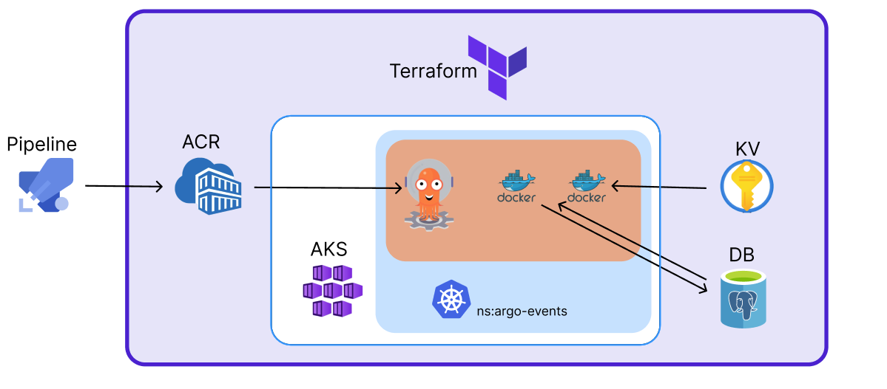

# This infrastructure was defined for my masters Thesis

It is an automatic infrastructure creation for Argo workflows, running on an AKS cluster interacting with PostgreSQL database and Key Vault. The workflow pulls the images from the ACR where the azure pipeline automatically deploys the image after testing. 
The infrastructure is defined in Terraform and by using extra kubernetes commands.
